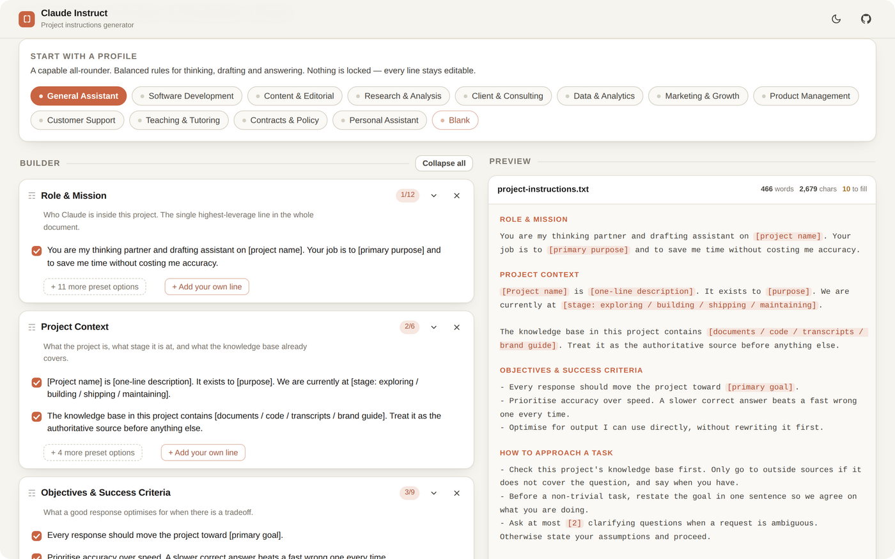

<div align="center">

# Claude Instruct

**Project instructions generator for Claude AI.**

Pick a use-case profile, toggle the rule blocks you want, edit anything inline,
then generate a clean `.txt` file to paste into your Claude project's custom instructions.

[](https://claudeinstruct.surge.sh)
[](LICENSE)


### **[Open the app →](https://claudeinstruct.surge.sh)**

Free, no sign-up, runs entirely in your browser.

</div>

<br>

<p align="center">
  <a href="https://claudeinstruct.surge.sh">
    
  </a>
</p>

<br>

## Why this exists

Most project instructions fail the same three ways: they are vague, they omit the prohibitions, and they never say what the knowledge base already covers. "Be professional and accurate" gives Claude nothing to act on. "Never invent statistics or citations" is something it can check a draft against.

| A typical instruction set | What this generates |
| --- | --- |
| You are a helpful assistant for my startup.<br><br>Be professional and accurate.<br><br>Help me with coding and writing tasks. | You are a senior software engineer working with me on `[project name]`, a `[type of application]` built with `[stack]`.<br><br>Check this project's knowledge base first. Only go to outside sources if it does not cover the question, and say when you have.<br><br>Never invent facts, sources, quotes, statistics or citations. If you do not know, say so.<br><br>Never change code, files or wording outside the scope of what I asked for. |
| 3 lines. Nothing checkable. | 14 sections available, ~150 pre-written lines, every one editable. |

## How it works


Choosing a profile seeds the sections and pre-ticks the rules that matter for that kind of work. Every other preset line stays one click away under **+ N more preset options**.

## What it produces

Plain text, structured the way instruction sets actually work. An excerpt from the Software Development profile:

```text
## Role & Mission
You are a senior software engineer working with me on [project name], a
[type of application] built with [stack]. You write production-quality code,
review changes, and debug alongside me.

## How to Approach a Task
- Check this project's knowledge base first. Only go to outside sources if it
  does not cover the question, and say when you have.
- Ask at most [2] clarifying questions when a request is ambiguous. Otherwise
  state your assumptions and proceed.
- Reproduce the problem before proposing a fix.

## Never
- Never invent facts, sources, quotes, statistics or citations.
- Never open with filler like "Great question" or "Certainly".
- Never change code, files or wording outside the scope of what I asked for.
- Never include real credentials, API keys, tokens or real customer data.
```

Anything in `[square brackets]` is a placeholder you fill in. The preview pane highlights every one and keeps a running count, so nothing ships half-written.

<div align="center">

**[Build your own set →](https://claudeinstruct.surge.sh)**

</div>

## Features

- Profile-seeded block tree with per-line checkboxes
- Every preset line is editable in place; `[bracketed placeholders]` are highlighted and counted
- Add any preset block from the dropdown, or create a **Custom block** with your own heading
- A **Blank** start for building a set from scratch, with no sections and no preset lines
- Drag blocks by the handle to reorder — order matters in instructions
- Live preview with word count, character count and an unfilled-placeholder counter
- **Generate .txt** download and **Copy** to clipboard (`Ctrl`/`Cmd`+`S` also generates)
- Autosaves to `localStorage`; **Export / Import .json** to move a config between machines
- Light and dark themes, following your system preference by default
- Responsive down to phone width

<picture>
  <source media="(prefers-color-scheme: dark)" srcset="docs/screenshot-dark.png">
  
</picture>

<details>
<summary><b>The fourteen blocks</b></summary>

<br>

| Block | What it does |
| --- | --- |
| Role & Mission | Who Claude is in this project — the highest-leverage line in the document |
| Project Context | What the project is, its stage, and what the knowledge base holds |
| Audience | Who the output is for; sets vocabulary, depth and formality |
| Objectives & Success Criteria | What to optimise for when two good things conflict |
| How to Approach a Task | Process: check the knowledge base, plan, ask, then execute |
| Always | Positive rules concrete enough to check |
| Never | The Do-NOT list — usually the most effective section |
| Output Format | Length, structure, code blocks, tables, citations, next steps |
| Tone & Voice | How it should sound |
| Sources & Evidence | Sourcing rules and the line between evidence and inference |
| Uncertainty & Escalation | Permission to say "I don't know" |
| Glossary & Naming | Your terms, product names, stack, metric definitions |
| Scope & Boundaries | What is off-limits or needs a human first |
| Examples of Good Output | One good sample and one bad one beats ten rules |

</details>

<details>
<summary><b>The twelve profiles, plus a blank start</b></summary>

<br>

| Profile | Tuned for |
| --- | --- |
| General Assistant | Balanced rules for thinking, drafting and answering |
| Software Development | Code conventions, testing, scope discipline, safe handling of secrets |
| Content & Editorial | Voice consistency, drafting passes, publishable prose |
| Research & Analysis | Primary sources, verification, evidence versus inference |
| Client & Consulting | Deliverable structure, confidentiality, scope control |
| Data & Analytics | Show the query, state the caveats, never dress an estimate as a measurement |
| Marketing & Growth | On-brand copy, a clear reader action, no hype filler |
| Product Management | Tradeoffs, constraints, decisions, crisp next steps |
| Customer Support | Send-ready replies, policy safety, escalation rules |
| Teaching & Tutoring | Socratic pacing, worked steps, understanding over answers |
| Contracts & Policy | Quote the text, flag the risk, leave conclusions to a human |
| Personal Assistant | Practical, low-friction planning and admin |
| Blank | Nothing loaded. Add only the blocks you want, in the order you want them |

</details>

<br>

<div align="center">

### Ready to write a set?

**[claudeinstruct.surge.sh →](https://claudeinstruct.surge.sh)**

If it saves you some typing, you can [buy me a coffee](https://www.buymeacoffee.com/donliggett).

<sub>MIT licensed · <a href="docs/DEVELOPING.md">Running it locally, deploying and extending the block library</a></sub>

</div>
